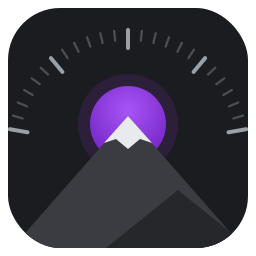
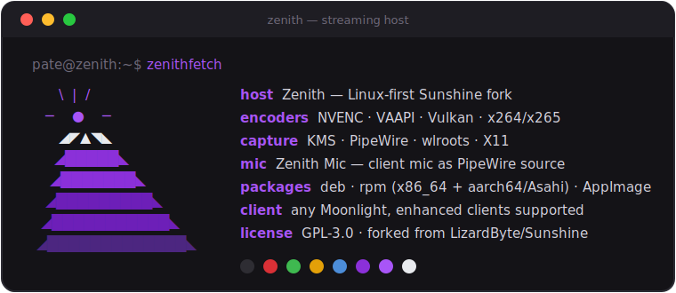

  
  <h1 align="center">Zenith</h1>
  <h4 align="center">Linux-first fork of Sunshine — a self-hosted game stream host for Moonlight.</h4>

  
  
  
  
  

 

  

## Why Zenith

The best Sunshine forks (Apollo, Sunshine-Foundation) are Windows-only because their headline
features are built on Windows virtual display drivers. Zenith ports the *ideas* everywhere — the
native way on Linux (PipeWire, KMS/DRM, Wayland) and with a bundled signed driver on Windows —
with NVIDIA **and** AMD as first-class citizens. Install it, pick **Headless** in Moonlight, and
a virtual display spins up at your client's exact resolution and refresh. No extra steps.

- 🖥️ **Plug-and-play virtual displays** — "Headless" and "Dual" work out of the box on
  Linux (KDE, GNOME, Sway/wlroots, Cinnamon) and on Windows (bundled signed SudoVDA driver).
  The display is *born when the app launches and destroyed when it quits*, at exactly the
  client's resolution and refresh — connect from a tablet, quit, pick up on a phone, and the
  phone gets its own screen rather than the tablet's. *Shipped.*
- 📍 **It stays where you put it** — drag the streaming display below your monitor, set a zoom
  you can read from the sofa, and it comes back there next session, even if you rezoomed your
  monitor or connected from a different device in between. *Shipped.*
- 🔌 **No kernel module on most machines** — if the host has a spare port, Zenith borrows it:
  a generated EDID on a real connector, on the same GPU that will encode it. No DKMS, no
  Secure Boot enrolment, no reboot. Machines with every port occupied fall back to EVDI, which
  `zenith-display setup` installs — or builds from source where no distro packages it (Arch).
  *Shipped.*
- 🎤 **Remote microphone** — your phone's mic shows up on the host as a real input device
  ("Zenith Mic") that Discord and games can use. On by default. *Shipped.*
- 📋 **Clipboard sync, both ways** — copy text or an image on either end, paste on the other.
  Large payloads move over the paired TLS connection. Wire-compatible with VoidLink and the
  Foundation-family clients. *Shipped.*
- 📁 **File transfer to the client** — push a file from the host to your connected device.
  *Beta.*
- ⚡ **Present-paced capture** — KMS capture wakes on real display vblanks instead of a
  timer: measured ~16ms → ~6-9ms host latency at high res on AMD. On by default
  (`capture_pacing = auto`); NVIDIA falls back to timer pacing automatically. *Shipped.*

See [ROADMAP.md](ROADMAP.md) for what's next.

## Install

Download the [latest release](https://github.com/jacksonpate/zenith/releases/latest) for your
platform:

| Platform | Package | Notes |
|----------|---------|-------|
| **Windows 10/11** | `Zenith-Windows-AMD64-installer.exe` | Bundles the virtual display driver; Secure Boot stays on. |
| **Ubuntu / Debian / Mint** | `zenith-*-amd64.deb` | `sudo apt install ./zenith-*.deb` |
| **Fedora / Nobara / Bazzite** | `zenith-fedora-*-x86_64.rpm` | `sudo dnf install ./zenith-*.rpm` |
| **Asahi Linux (Apple Silicon)** | `zenith-fedora-*-aarch64.rpm` | Fedora Asahi Remix. |

Then open `https://<host-ip>:47990`, set a username and password, and pair Moonlight/VoidLink.
Zenith runs under its own identity — the `zenith` binary, the `io.github.jacksonpate.Zenith`
service, and config under `~/.config/zenith/`. The Linux packages *Conflict with* and *Replace* a
distro `sunshine` package, so installing Zenith supersedes an existing Sunshine rather than running
a second host on the same ports. Settings and pairings do not migrate across, so you pair once.

> **Windows SmartScreen**: the installer isn't code-signed yet, so Windows may show
> "Windows protected your PC." Click **More info → Run anyway**.

Prefer to build from source? See the [local build notes](docs/building_zenith_local.md).

## Community

Questions, bug reports, or you got it working on something unusual — come say so.

- 💬 **[Discord](https://discord.gg/X7vTVmMBDK)** — support, and where new features get argued about first.
- 🐛 **[Issues](https://github.com/jacksonpate/zenith/issues)** — bugs and feature requests.

If a virtual display misbehaves, `zenith-display doctor` prints what Zenith can see of your
machine — session, compositor, connectors, and which provider it would use and why. Paste that
into an issue and you have skipped three rounds of back-and-forth.

## Credits & license

Zenith is a fork of [LizardByte/Sunshine](https://github.com/LizardByte/Sunshine) and stands on
their work — go star them, sponsor them, and read their excellent
[documentation](https://docs.lizardbyte.dev/projects/sunshine/latest/), which applies to Zenith
for everything not listed above. Feature inspiration from
[Sunshine-Foundation](https://github.com/AlkaidLab/foundation-sunshine) and
[Apollo](https://github.com/ClassicOldSong/Apollo), reimplemented for Linux.

Licensed [GPL-3.0](LICENSE), same as upstream. Third-party notices: [NOTICE](NOTICE).
